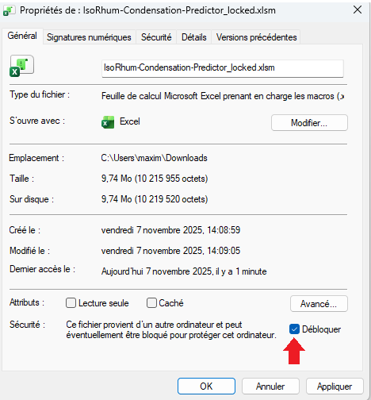
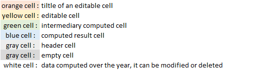
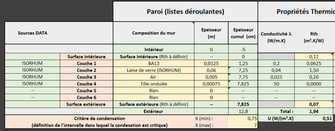
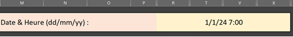
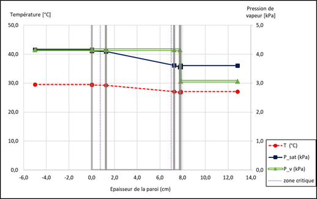
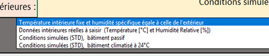

# ISORHUM Project - Excel Tool

## Installation

To get started, clone the repository or download one of both Excel files:

- **IsoRhum-Condensation-Predictor_open.xlsm** $\to$ an open version allowing free modification of all cells
- **IsoRhum-Condensation-Predictor_locked.xlsm** $\to$ a locked version to perform calculations without issues

```bash
git clone https://github.com/maximestph/Glaser-Predictor.git
cd mon-projet
```

Please ensure the worksheet protection is unlocked to allow proper use of VBA macros (right-click $\to$ Properties) :




## Introduction
This Excel file was developed as part of the ISORHUM project within the OMBREE program.  It was created through a collaboration between the PIMENT laboratory (University of La Réunion) and the IMAGREEN consulting firm. It is based on work carried out by all the partners involved in the ISORHUM project.

This workbook offers an a priori prediction of condensation risks over one year within an insulating wall, using the Glaser model.

The Glaser model is limited to describing the steady-state regime, unlike coupled heat, air, and moisture (HAM) models, which account for transient phenomena. This limitation should be considered, especially when two layers with high resistance to water vapor diffusion are stacked. In such cases, wall desorption is delayed, preventing the rapid attainment of the steady-state regime.

This document in no way replaces official reference texts, whether regulatory (laws, decrees, orders, etc.), normative (standards, DTUs, professional rules, RAGE and PACTE recommendations, or calculation rules), or codified (technical approvals, technical specifications guides, etc.), which must be consulted. The CSTB declines all responsibility for any direct or indirect consequences of any kind that may result from any misinterpretation of the content of this document.

**Author contact :** maxime.stephan-phd@protonmail.com	

## Color code

A color code is used in worksheets to identify different cell functions :


## Wall definition

The PAROI_GLASER worksheet allows users to build a custom composite insulating wall layer by layer. The user interface is shown in the following picture :



A maximum of six layers can be defined, with layer 1 corresponding to the interior face of the wall. Materials are selected using a drop-down list that refers to the Materials worksheet. This worksheet is editable, allowing new materials to be added or existing ones to be modified. Each layer is assigned a thickness that must be specified. All properties of the layer are then automatically retrieved and calculated.

A surface thermal resistance coefficient (Rth in m²·K/W) must be assigned to the interior and exterior surfaces, describing the resistance to convective heat transfer.

It has been experimentally shown that metal sheets placed on roofs exhibit a surface temperature significantly different from the ambient air temperature: higher during the day due to solar radiation, and lower at night because of radiative exchanges with the cold sky. Thus, when a metallic material (λ > 20 W/m·K) is used on the surface, the surface temperature is considered instead of the outdoor air temperature. In this case, the thermal resistance of the exterior surface has no effect.

When fewer than six layers are used, the remaining layers must be defined with the material named "Rien" (placed at the top of the list) and a zero thickness, as illustrated in the picture above. 

## Glaser calculation on a single time step

On the PAROI-GLASER worksheet, the "Date" entry, visible in the picture bellow, allows selecting a date time from the climate file, extracting the boundary conditions, and then calculating the temperature and vapor gradients for that time step.



The gradients computed using Glaser Model are shown on the graph to the right of the sheet, visible bellow. Condensation is detected when the calculated vapor pressure of water exceeds the saturation vapor pressure.



On this chart, the different layers of the wall are shown in gray. The critical zone, indicated in purple, must be specified in the dedicated cells (visible in the wall definition user interface picture). It defines a range of distances within the wall where condensation is an issue. Outside this range, condensation may be detected but will not trigger the criticality indicator.

## Weather data

 Weather data constitute the boundary conditions for the Glaser model. They must be entered in the CLIMAT worksheet. Two climatic conditions need to be specified:

**- External conditions:** 

Several locations are pre-recorded in this workbook with their associated conditions. However, it is possible to unlock cells to enter custom data (duration: 1 year, time step: 1 hour, i.e. 8.760 time steps).


**- Internal condition :**

Each pre-recorded location is associated with a set of indoor conditions obtained through Dynamic Thermal Simulations (DTS). These simulations were carried out assuming a passive building and, when relevant, an air-conditioned building at 24 °C. It is also possible to unlock cells to enter custom data. Finally, a fixed temperature as well as a specific humidity equal to that of the outdoor conditions can also be specified.



After modifying the climate settings, it is essential to press the "Modify Climate" button for the changes to take effect.

## Calculation over year

The CALCUL_ANNEE worksheet allows the Glaser model to be calculated over all time steps. The "Calculate Glaser over the year" button starts this calculation.

The results table contains a copy of the weather conditions (outdoor and indoor) as well as the Glaser calculation results. The columns X_min and X_max correspond to the boundaries where the vapor pressure exceeds the saturation pressure (P_v > P_sat). The "Critical?" column indicates whether the condensation is considered critical, taking into account the critical zone specified in the PAROI_GLASER sheet. Thus, condensation can be detected without being considered critical when it occurs outside this zone.

## Edit the calculation report

The RAPPORT worksheet compiles the "Critical?" column from the CALCUL_ANNEE worksheet. The risk indicators correspond to the ratio between the number of time steps where critical condensation is detected and the total number of time steps.

Two time division tools are implemented, seasonal division and temporal division :

The year is divided into two seasons: summer and winter, with the possibility to modify the transition dates. To study a specific month, simply set the season start date to the 1st day and the season end date to the 31st day of that month.

Each day is divided into two periods, labeled "day" and "night," with the possibility to modify the transition hours. Similarly to the seasonal analysis, it is possible to study nightfall by specifying the start of day at 6 PM and the start of night at 8 PM.

The combined risk allows associating the seasonal and daily analyses to determine when during the year and day the risk of condensation is the highest.

Finally, the commentary zone allows to freely add notes.


Under this header, various psychrometric charts display the critical outdoor conditions over the year, as well as according to the seasonal and daily divisions.


The "Export PDF" button in the report header allows saving the RAPPORT sheet in PDF format. You will be prompted to select the pages to export.


## Materials

The Materials sheet allows adding or modifying the database used for the Glaser calculation. To add a new material, a new row must be inserted.


